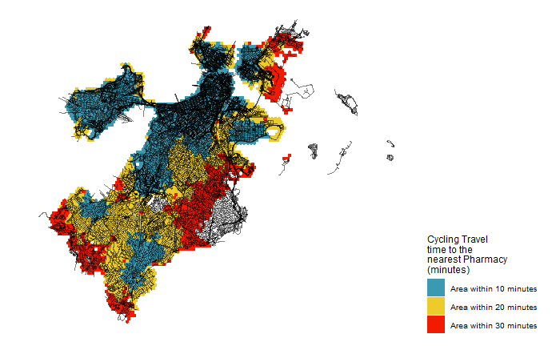
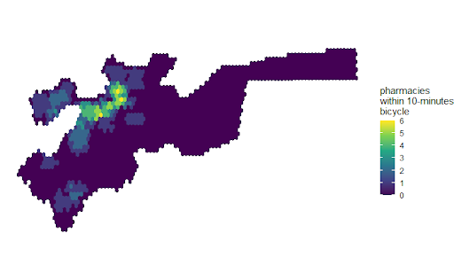
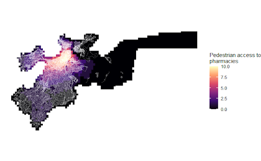
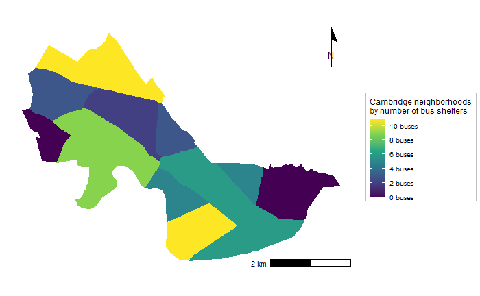
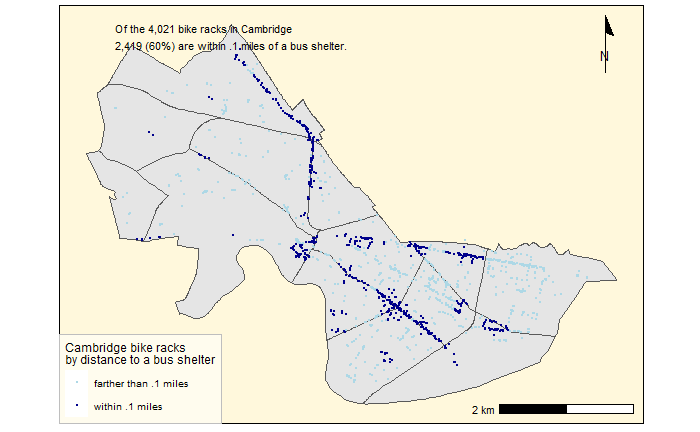

```{r setup, include=FALSE}
knitr::opts_chunk$set(echo = TRUE)
```

# Introduction

This portfolio is a collection of maps created in Professor Carole Voulgaris' Spatial Analysis class (VIS 2128).

The content in the maps below demonstrate the following skills:

* Displaying multiple vector layers on the same map
* Calculating and displaying relationships among point and polygon layers based on distance
* Aggregating point data to a layer of polygons
* Calculating and displaying accessibility, based on travel time
* Converting between raster layers and vector layers
* Displaying raster data on a map
* Georeferencing a raster image
* Displaying data on an interactive map

# Maps of Boston
Here are three maps of Boston, Massachusetts. The first shows proximity in 10, 20 and 30 minutes by cycling to the nearest pharmacy. The second map is a density map that filters the Boston area to show the parts 10 minutes from a pharmacy and how many pharmacies.
The third map assigns an accessibility score (from 0-10) to pedestrian access in the Boston area.This map shows accessibility based on a distance-decay function of the cyclying time to the nearest pharmacy.

## Map 1
This map demonstrates the following skills:
*Displaying multiple vector layers on the same map
*Calculating and displaying accessibility based on travel time

[](https://femiolamijulo.github.io/my-portfolio/fullsize/001.png){target="_blank"}

## Map 2
This map demonstrates the following skills:
*Displaying multiple vector layers on the same map
*Calculating and displaying accessibility based on travel time
*Displaying raster data on a map


[](https://femiolamijulo.github.io/my-portfolio/fullsize/002.png){target="_blank"}

## Map 3
This map demonstrates the following skills:
*Displaying multiple vector layers on the same map
*Calculating and displaying accessibility based on travel time
*Converting from raster layer to vector layer

[](https://femiolamijulo.github.io/my-portfolio/fullsize/003.png){target="_blank"}

# Map of Detroit
This interactive map highlights the percentage of population per block that identify as only black.
Click on the map to explore the neighborhood block information.

## Map 4
This interactive map demonstrates the following skills: 

* Displaying data on an interactive map


[](https://femiolamijulo.github.io/my-portfolio/fullsize/inter_black.html){target="_blank"}


# Map of Allston
In this map, three layers of public space, building footprint and the current roadnetwork are imposed on a georeferenced old map of the Allston neighborhood.

## Map 5
This map demonstrates the following skills:
*Georeferencing a raster image

[](https://femiolamijulo.github.io/my-portfolio/fullsize/005.png){target="_blank"}


# Map of Cambridge

The first map aggregates the number of bus stops in each neighborhood polygon for the city of Cambridge. The second map filters out bike racks that are within 0.1 miles to a bus shelter in the area.

## Map 6
This map demonstrates the following skills:
*Aggregating point data to a layer of polygons

[](https://femiolamijulo.github.io/my-portfolio/fullsize/006.png){target="_blank"}

## Map 7
This map demonstrates the following skills:
*Calculating and displaying relationships among point & polygon layers based on distance

[](https://femiolamijulo.github.io/my-portfolio/fullsize/007.png){target="_blank"}


```

