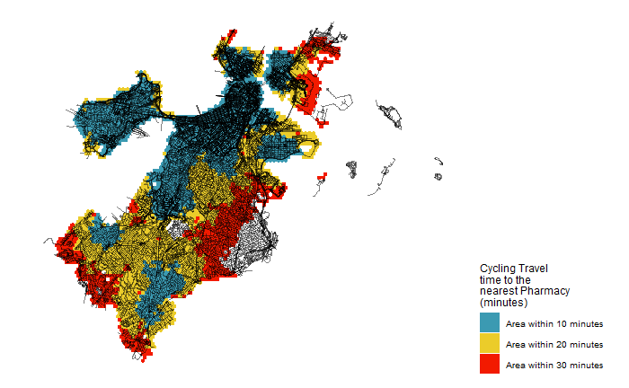
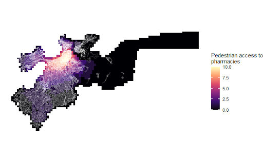

```{r setup, include=FALSE}
knitr::opts_chunk$set(echo = TRUE)
```

# Introduction

This portfolio is a collection of maps created in Professor Carole Voulgaris' Spatial Analysis class (VIS 2128).

The content in the maps below demonstrate the following skills:

* Displaying multiple vector layers on the same map
* Calculating and displaying relationships among point and polygon layers based on distance
* Aggregating point data to a layer of polygons
* Calculating and displaying accessibility, based on travel time
* Converting between raster layers and vector layers
* Displaying raster data on a map
* Georeferencing a raster image
* Displaying data on an interactive map

# Maps of Boston
Here are three maps of Boston, Massachusetts. The first shows proximity in 10, 20 and 30 minutes by cycling to the nearest pharmacy. The second map is a density map that filters the Boston area to show the parts 10 minutes from a pharmacy and how many pharmacies.
The third map assigns an accessibility score (from 0-10) to pedestrian access in the Boston area.

## Map 1
This map demonstrates the following skills:
*Displaying multiple vector layers on the same map
*Calculating and displaying accessibility based on travel time

[](https://femiolamijulo.github.io/my-portfolio/fullsize/001.png){target="_blank"}

## Map 2
This map demonstrates the following skills:
*Displaying multiple vector layers on the same map
*Calculating and displaying accessibility based on travel time
*Displaying raster data on a map


[](https://femiolamijulo.github.io/my-portfolio/fullsize/002.png){target="_blank"}

## Map 3
This map demonstrates the following skills:
*Displaying multiple vector layers on the same map
*Calculating and displaying accessibility based on travel time
*Converting from raster layer to vector layer

[](https://femiolamijulo.github.io/my-portfolio/fullsize/003.png){target="_blank"}

## Map 4
This interactive map demonstrates the following skills: 

* Displaying data on an interactive map


[](https://c-voulgaris.github.io/portfolio_examples/fullsize/inter_black.html){target="_blank"}


the number of pharmacies within what percentage of neighborhood block identifies as only Black. The second map layers information on the percentage of population using public transit for each block with bus station location.

## Interactive Map


## Clockboard Map
This map demonstrates the following skills:

* Aggregating point data to a layer of polygons

[](https://c-voulgaris.github.io/portfolio_examples/fullsize/clockboard.pdf){target="_blank"}

# Maps of San Luis Obispo
Here are two maps of San Luis Obispo, California. I might include some text here as well.

## Isochrones
This map shows isochrones based on transit travel times to the nearest school. It demonstrates the following skills:

* Displaying multiple vector layers on the same map
* Calculating and displaying accessibility, based on travel time

[](https://c-voulgaris.github.io/portfolio_examples/fullsize/SLO_schools.pdf){target="_blank"}

## Accessibility
This map shows accessibility based on a distance-decay function of the walking time to the nearest transit stop. It demonstrates the following skills:

* Displaying multiple vector layers on the same map
* Calculating and displaying accessibility, based on travel time
* Displaying raster data on a map

[](https://c-voulgaris.github.io/portfolio_examples/fullsize/SLO_transit.pdf){target="_blank"}
